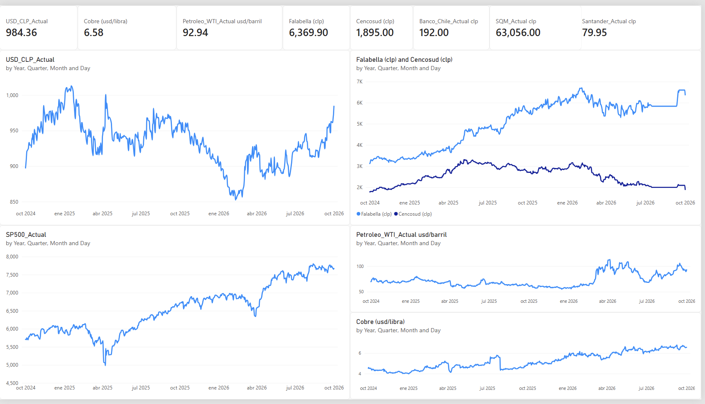

# Query: 
# ContextLines: 1

# Chilean Financial Market & Global Benchmarks Dashboard

Un dashboard financiero e interactivo que automatiza la extracción, procesamiento y visualización de datos de los principales activos del mercado financiero chileno (IPSA, Retail, Banca) y commodities/benchmarks globales.

---

## Dashboard Overview



---

## Tech Stack & Architecture

- **ETL & Data Pipeline:** Python (`yfinance`, `pandas`) para automatizar la extracción de series de tiempo históricas y cálculo de retornos.
- **Data Visualization & Analytics:** Power BI Desktop, métricas DAX (`LASTNONBLANKVALUE` para precios al cierre diarios) y modelado de datos.
- **Version Control:** Git & GitHub.

---

## 📈 Assets Tracked

- **Tipo de Cambio:** USD/CLP
- **Commodities:** Cobre (Futuros USD/lb) y Petróleo WTI (USD/barril)
- **Acciones Chilenas (IPSA):** Falabella, Cencosud, Banco de Chile, Banco Santander Chile, SQM
- **Benchmark Global:** S&P 500 Index (`^GSPC`)

---

## Cómo ejecutar el proyecto

1. **Clonar el repositorio:**
   ```bash
   git clone [https://github.com/TU_USUARIO/TU_REPOSITORIO.git](https://github.com/TU_USUARIO/TU_REPOSITORIO.git)
   cd TU_REPOSITORIO

Instalar dependencias de Python:

pip install -r requirements.txt

Ejecutar el script ETL:

python scripts/download_data.py

Abrir el Dashboard:
Abre el archivo power_bi/dashboard_mercado_chile.pbix en Power BI Desktop para interactuar con el modelo y los visuales.

Abre el archivo power_bi/dashboard_mercado_chile.pbix en Power BI Desktop para interactuar con el modelo y los visuales.
